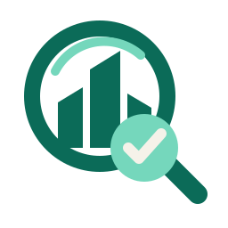

<div align="center">
  
  <h1>Lead Generator</h1>
  <p><strong>Recherche B2B sourcée, qualification humaine et enrichissement sous contrôle.</strong></p>

  <p>
    <a href="https://github.com/ncleton/leadgenerator/actions/workflows/ci.yml"></a>
    <a href="https://github.com/ncleton/leadgenerator/actions/workflows/privacy.yml"></a>
    <a href="https://github.com/ncleton/leadgenerator/releases/tag/v0.3.1"></a>
    <a href="LICENSE"></a>
  </p>

  <p>
    <a href="https://www.python.org/"></a>
    <a href="https://docs.astral.sh/uv/"></a>
    <a href="https://developers.openai.com/codex/"></a>
    <a href="https://modelcontextprotocol.io/"></a>
  </p>
  <p>
    <a href="https://playwright.dev/python/"></a>
    <a href="https://docs.pydantic.dev/"></a>
    <a href="https://www.crummy.com/software/BeautifulSoup/"></a>
    <a href="https://github.com/Alir3z4/html2text"></a>
    <a href="https://pypdf.readthedocs.io/"></a>
    <a href="https://docs.pytest.org/"></a>
    <a href="https://docs.astral.sh/ruff/"></a>
    <a href="https://black.readthedocs.io/"></a>
    <a href="https://enrow.io/"></a>
    <a href="https://fullenrich.com/"></a>
    <a href="https://developers.hubspot.com/"></a>
  </p>
</div>

Lead Generator, par **Yaka Performance**, est un plugin Codex de recherche commerciale B2B avec validation
humaine. Il transforme une cible en recherche d'entreprises françaises, rassemble
des preuves publiques et identifie des décideurs. Chaque objectif possède son
agent persistant, ses consignes, exemples, rôles cibles et documents privés. Le
routeur conserve l'objectif de la conversation et demande une clarification
lorsque plusieurs objectifs sont plausibles. Chaque installation choisit
entre une interface contextuelle dans le chat et un mode minimal avec uniquement
du texte et des liens. L'enrichissement payant et l'écriture HubSpot restent
bloqués jusqu'à une confirmation explicite.

## Enrichissement des contacts avec Enrow et FullEnrich

Lead Generator enrichit uniquement un contact professionnel dont l'identité a
été vérifiée. La cascade recherche l'**e-mail professionnel** et, lorsque les
conditions du fournisseur sont remplies, le **téléphone professionnel** :

1. **Enrow passe en premier**, car il constitue la source prioritaire et la moins
   coûteuse pour la recherche demandée.
2. **FullEnrich intervient en recours** seulement lorsqu'Enrow a terminé sans
   trouver le champ demandé, afin d'améliorer la couverture et la recherche de
   mobile.
3. Chaque appel payant exige une **confirmation humaine explicite**. Le recours à
   FullEnrich fait l'objet d'une seconde confirmation ciblée sur les données
   encore manquantes.

Les résultats restent rattachés à l'identité professionnelle et à leurs preuves.
Lead Generator n'invente aucune coordonnée et ne contacte jamais la personne
automatiquement.

## Structure du dépôt

```text
.
├── .agents/plugins/marketplace.json   # catalogue local Codex
├── plugins/lead-studio/               # plugin distribuable autonome
│   ├── .codex-plugin/plugin.json      # manifeste officiel du plugin
│   ├── .mcp.json                      # serveur MCP lancé par Codex
│   ├── skills/                        # instructions conversationnelles
│   ├── src/lead_studio/               # code Python du runtime
│   ├── pyproject.toml                 # dépendances et outils de qualité
│   └── uv.lock                        # versions Python reproductibles
├── tests/                             # miroir des responsabilités du runtime
├── docs/                              # architecture, sécurité et attribution
└── scripts/                           # installation client uniquement
```

Consulter [docs/file-map.md](docs/file-map.md) pour expliquer le rôle de chaque
famille de fichiers pendant une formation.

## Installation

Prérequis : [Codex](https://developers.openai.com/codex/),
[`uv`](https://docs.astral.sh/uv/) et une connexion Internet.

macOS ou Linux :

```bash
git clone https://github.com/ncleton/leadgenerator.git
cd leadgenerator
./scripts/install_client.sh
```

Windows PowerShell :

```powershell
git clone https://github.com/ncleton/leadgenerator.git
Set-Location leadgenerator
.\scripts\install_client.ps1
```

Ouvrir ensuite une nouvelle tâche Codex et demander : « Trouve-moi des prospects
et affiche le parcours Lead Generator. »

Les objectifs sont conservés dans `~/.codex/lead-studio/objectives/`. Les anciens
profils d'offre peuvent être migrés sans suppression avec la commande
conversationnelle « Migre mes profils d'offre en agents d'objectif ». Les PDF,
DOCX, fichiers texte, Markdown, JSON, CSV et HTML joints à un objectif sont
copiés, hachés et traités comme des preuves non fiables.

Le mode interface est activé par défaut pour conserver l'expérience existante.
Il se change directement dans la conversation, par exemple : « Désactive les
interfaces Lead Generator » ou « Réactive le mode interface ». Le choix est conservé
localement dans `~/.codex/lead-studio/preferences.json`. En mode texte, les
ressources d'interface sont inaccessibles et les résultats gardent leurs liens
sources.

## Développement

```bash
uv sync --project plugins/lead-studio --frozen
uv run --project plugins/lead-studio playwright install chromium
./scripts/validate.sh
```

## Principes produit

- sources professionnelles publiques et pertinentes uniquement ;
- faits observés, preuves et hypothèses toujours séparés ;
- aucune donnée personnelle inventée ni contournement d'accès ;
- aucune prospection envoyée automatiquement ;
- confirmation humaine au point exact d'une dépense ou d'une écriture CRM ;
- profils et secrets conservés hors du plugin partagé ;
- relation durable 1:1 entre objectif et agent, sans mélange de contexte ;
- cascade Enrow puis FullEnrich liée à l'identité et confirmée par étape ;
- association HubSpot contact-entreprise vérifiée par domaine ou SIREN ;
- préférence d'interface locale, réversible et appliquée côté serveur ;
- aucun nom, entreprise, site ou critère client dans un guide partageable.

## Documentation

- [Architecture](docs/architecture.md)
- [Carte des fichiers](docs/file-map.md)
- [Sécurité et validation humaine](docs/safety.md)

## Sécurité, support et maintenance

Ne publiez jamais de clé API, profil vendeur, donnée client, export de leads
ou session de navigateur. Consultez [SECURITY.md](SECURITY.md) pour signaler une
vulnérabilité et [SUPPORT.md](SUPPORT.md) pour demander de l'aide.

Le projet suit le versionnage sémantique. Les changements sont documentés dans
[CHANGELOG.md](CHANGELOG.md). Les dépendances sont suivies par Dependabot et toute
modification doit passer les contrôles CI et confidentialité avant fusion.
