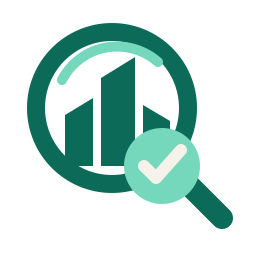

<div align="center">
  
  <h1>Lead Generator</h1>
  <p><strong>Recherche B2B sourcée, qualification humaine et enrichissement sous contrôle.</strong></p>

  <p>
    <a href="https://github.com/ncleton/leadgenerator/actions/workflows/ci.yml"></a>
    <a href="https://github.com/ncleton/leadgenerator/actions/workflows/privacy.yml"></a>
    <a href="https://github.com/ncleton/leadgenerator/releases/tag/v0.4.0"></a>
    <a href="LICENSE"></a>
  </p>

</div>

Lead Generator est un assistant de prospection B2B créé par **Yaka Performance**.
Il vous aide à trouver des entreprises françaises, comprendre leur activité,
repérer des projets pertinents et identifier les bons interlocuteurs.

Il s'utilise dans une conversation avec **Codex ou Claude**. Vous décrivez votre
besoin, l'agent mène la recherche et vous présente des fiches avec leurs sources.
Vous choisissez les entreprises à approfondir et les actions à effectuer.

## Comment ça fonctionne

1. **Définissez votre objectif.** Indiquez ce que vous vendez, à qui et dans quelle
   zone. L'agent vous demande le site de votre entreprise pour comprendre votre
   offre. Vous pouvez ajouter des documents, des consignes et des rôles à cibler.
2. **Lancez une recherche.** Précisez le secteur, la taille des entreprises, la
   localisation et le nombre de résultats souhaité. L'agent consulte le registre
   officiel des entreprises et recherche des informations sur leurs sites et
   dans des sources professionnelles.
3. **Examinez les résultats.** Parcourez les entreprises sur une carte ou dans une
   liste. Chaque fiche distingue les informations vérifiées, les hypothèses
   commerciales et les éléments qu'il reste à confirmer.
4. **Approfondissez votre sélection.** Demandez une analyse de l'entreprise, de
   son actualité ou de ses décideurs. L'agent classe les contacts selon votre
   objectif et peut préparer un message de prospection à relire.
5. **Validez la suite.** Vous décidez de rechercher des coordonnées professionnelles
   ou de transmettre les contacts retenus à HubSpot. L'agent n'envoie aucun
   message de prospection.

## Ce que vous pouvez consulter

- **Entreprises** : activité, taille, établissements, actualités et signaux
  commerciaux, avec des liens vers les sources.
- **Carte et satellite** : localisation des entreprises ou des sites étudiés.
  Une position approximative est signalée comme telle ; elle ne prouve pas
  l'emplacement exact d'un bâtiment.
- **Contacts** : interlocuteurs proposés, fonction, éléments de vérification et
  pertinence pour votre objectif.
- **Visuels** : logo, photos et vue aérienne lorsque des sources utilisables sont
  disponibles.

L'agent ne garantit pas qu'une recherche fournira le nombre demandé de prospects
pertinents, ni qu'une coordonnée sera disponible. Les informations manquantes
doivent être signalées, jamais inventées.

## Objectifs et réglages

Un objectif regroupe une offre, une cible, une zone et des consignes de recherche.
Vous pouvez en créer plusieurs pour séparer vos activités ou campagnes.

Demandez **« Ouvre mes objectifs »** pour les consulter ou les modifier, et
**« Ouvre les réglages »** pour ajuster les préférences. Vous pouvez notamment
changer le nombre de résultats souhaité et choisir une présentation visuelle
ou une réponse en texte avec les liens sources.

Dans Codex, vous pouvez planifier des recherches par objectif. La planification
doit être activée et confirmée ; l'ordinateur doit rester allumé avec Codex
ouvert. Ces planifications sont consultables, mais pas modifiables, dans Claude.
[Comprendre les recherches planifiées](docs/objective-scheduling.md).

## Services complémentaires

La recherche d'entreprises et l'analyse de sources publiques ne nécessitent
pas de service d'enrichissement payant.

- **Réseaux sociaux** : l'agent peut consulter des profils et publications
  professionnels sur LinkedIn, X, Reddit, Facebook et Instagram avec les
  connexions compatibles. L'utilisation d'une session connectée nécessite votre
  accord. Vous vous identifiez directement dans le navigateur, jamais dans la
  conversation. [Configurer les connexions](docs/social-connectors.md).
- **Enrow et FullEnrich** : ces services recherchent un e-mail ou un téléphone
  professionnel pour un contact dont l'identité a été vérifiée. Enrow est utilisé
  en premier ; FullEnrich peut compléter les champs manquants. Chaque appel
  payant, y compris le recours à FullEnrich, exige votre confirmation.
- **HubSpot** : l'agent prépare l'ajout des contacts sélectionnés à une liste et
  leur attribution à un responsable. Vous vérifiez l'aperçu et confirmez avant
  toute écriture dans le CRM.

## Installer dans Codex

### Mac ou Linux

Installez [Codex](https://developers.openai.com/codex/),
[uv](https://docs.astral.sh/uv/) et Git, puis exécutez :

```bash
git clone https://github.com/ncleton/leadgenerator.git
cd leadgenerator
./scripts/install_client.sh
```

### Windows

Téléchargez le projet avec **Code → Download ZIP**, décompressez-le, puis
double-cliquez sur `scripts\install_client.cmd`.

L'installateur prend en charge les prérequis et vérifie le fonctionnement de
l'agent. Vous pouvez aussi utiliser PowerShell avec Git installé :

```powershell
git clone https://github.com/ncleton/leadgenerator.git
Set-Location leadgenerator
.\scripts\install_client.ps1
```

### Première utilisation

Après l'installation, **quittez complètement Codex puis relancez-le**.
Ouvrez une nouvelle conversation et demandez :

> Utilise Lead Generator et aide-moi à définir mon objectif de prospection.

Une fois votre offre et votre cible définies, demandez une recherche.
Une connexion Internet est nécessaire. PostgreSQL est facultatif pour commencer,
mais nécessaire pour conserver l'historique des entreprises.

## Installer dans Claude

Pour utiliser le projet dans l'onglet **Code** de Claude Desktop, installez
Git, Node.js et [uv](https://docs.astral.sh/uv/), puis exécutez :

```bash
git clone https://github.com/ncleton/leadgenerator.git
cd leadgenerator
node scripts/claude/setup.cjs
```

Ouvrez ce dossier comme projet local dans Claude et demandez :

> Utilise Lead Generator et aide-moi à définir mon objectif de prospection.

Claude prépare la connexion au moteur. Acceptez les autorisations demandées par
l'application et redémarrez-la si nécessaire. Le script de préparation ne remplace
pas vos fichiers de configuration personnalisés.

L'affichage visuel dépend des capacités de votre version de Claude. Dans un
terminal, utilisez le mode texte.
Le [guide Claude](docs/claude-installation.md) détaille les prérequis, les formats
d'installation et les limites de chaque environnement.

## Données et confidentialité

Vos objectifs, documents, réglages et clés de services sont conservés localement.
Ils ne sont pas inclus dans le dépôt GitHub et ne sont pas transférés
automatiquement lorsque vous installez l'agent sur un autre ordinateur.

La mémoire des entreprises utilise une base PostgreSQL locale. Elle permet de
retrouver les fiches, de conserver leur historique et d'éviter de reproposer
les entreprises déjà étudiées. Si PostgreSQL est installé, créez la base avec :

```bash
createdb leadgenerator
```

Une autre base peut être configurée avec `LEADGENERATOR_DATABASE_URL`.
Les profils sont stockés sous `~/.codex/leadgenerator/` ; les exports privés
du projet sont placés dans `.agent-private/`.

Le stockage local ne signifie pas que la recherche est hors ligne : les sites
consultés et les services utilisés reçoivent les requêtes nécessaires. Ne
partagez pas de secrets dans vos demandes ni dans les fichiers destinés à GitHub.

## Aide et documentation

- [Assistance et signalement de problèmes](SUPPORT.md)
- [Sécurité et validation humaine](docs/safety.md)
- [Signaler une vulnérabilité](SECURITY.md)
- [Personnaliser l'interface](docs/ui-customization.md)
- [Documentation Claude](docs/claude-installation.md)

## Pour les développeurs

Le moteur est écrit en Python 3.13. Il expose ses outils et son interface à Codex
et Claude via MCP, un protocole de connexion entre assistants et outils.

`plugins/leadgenerator/` contient le moteur et les consignes de l'agent,
`tests/` les tests, `scripts/` les commandes d'installation et de validation,
et `docs/` la documentation technique.

```bash
uv sync --project plugins/leadgenerator --frozen
uv run --project plugins/leadgenerator playwright install chromium
./scripts/validate.sh
```

Consultez les [règles de contribution](CONTRIBUTING.md),
l'[architecture](docs/architecture.md), le [SDK](docs/plugin-sdk.md) et
le [changelog](CHANGELOG.md). Le projet est distribué sous [licence MIT](LICENSE).

<details>
<summary>Technologies et intégrations</summary>

<p>
    <a href="https://www.python.org/"></a>
    <a href="https://docs.astral.sh/uv/"></a>
    <a href="https://developers.openai.com/codex/"></a>
    <a href="https://modelcontextprotocol.io/"></a>
    <a href="https://www.postgresql.org/"></a>
  </p>
  <p>
    <a href="https://playwright.dev/python/"></a>
    <a href="https://docs.pydantic.dev/"></a>
    <a href="https://www.psycopg.org/psycopg3/docs/"></a>
    <a href="https://www.crummy.com/software/BeautifulSoup/"></a>
    <a href="https://github.com/Alir3z4/html2text"></a>
    <a href="https://pypdf.readthedocs.io/"></a>
    <a href="https://docs.pytest.org/"></a>
    <a href="https://docs.astral.sh/ruff/"></a>
    <a href="https://black.readthedocs.io/"></a>
    <a href="https://enrow.io/"></a>
    <a href="https://fullenrich.com/"></a>
    <a href="https://developers.hubspot.com/"></a>
  </p>

</details>
